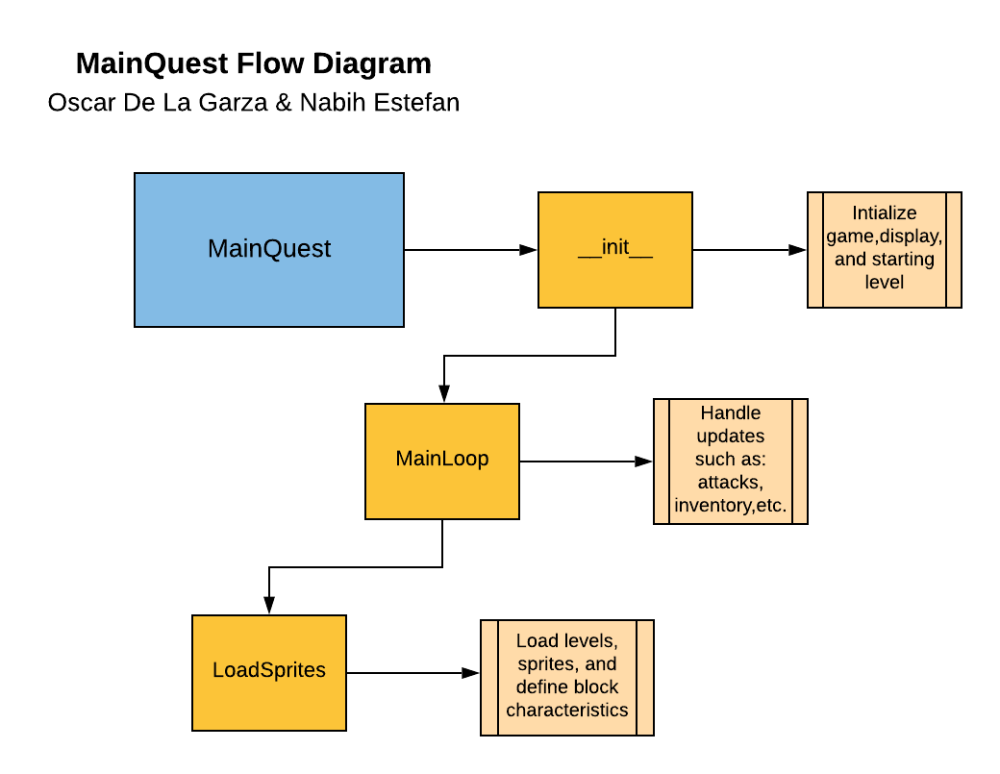

# Medieval Quest

This is an overview of the MainQuest Flow Diagram and how to interpret it.

## MainQuest Flow Diagram

In our "MainQuest" Class has 3 functions inside "init", "MainLoop", and "LoadSprites". The "init" function creates the display, defines the borders, and intializes the starting level as level22. "MainLoop" loads up the game and player and proceeds to define winning and losing scenarios, and then checks for updates of the player attacking, movement, level-frame changes, inventory, etc. Finally "Loadsprites" handles loading what level you are on as well as defining charcterstics of sprites such as blocks, enemies, player, or projectiles to name a few.
