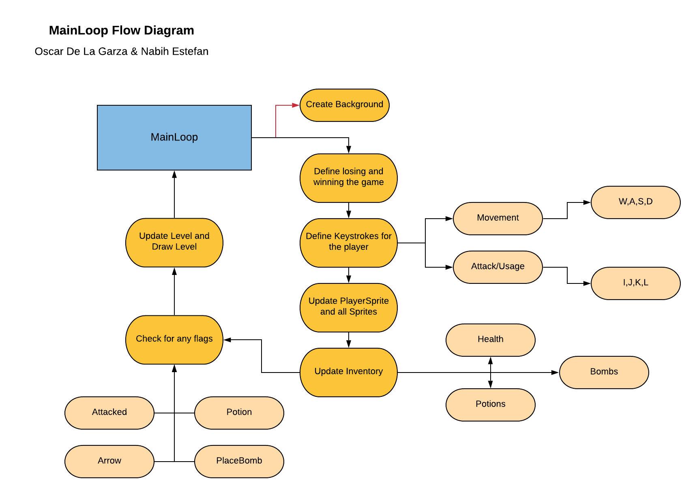

# Medieval Quest

This is an overview of the "MainLoop Flow Diagram" and how to interpret it.

## MainLoop Flow Diagram

 
 Here we see "MainLoop", which is apart of our "MainQuest" class, which handles updates and running the game. It begins by creating the background for the level, then defines the losing situation of you dying or the winning one of reaching your castle. After having done this the fucntion defines keystrokes for the player, such as his movement: standard W,A,S,D for the 4 directions, and I,J,K,L for sword attack, bow attack, bomb, and potion respectively. The loop then proceeds to update the player and any other sprite based on these keystrokes. It then checks your inventory and upates it for any item gained or used. The loop will then proceed to check for any predefined flags, such as being "Attacked", using a "Potion", Shooting an "Arrow", or placing a bomb, "PlaceBomb". These trigger specific updates for the game such as remove health or deal damage. Lastly it updates the level and draws it based on these inputs and updates previously triggered.
