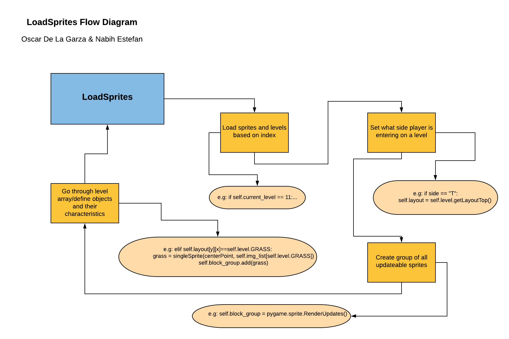

# Medieval Quest

This is a rundown of the LoadSprites Diagram and how to interpret it.

## LoadSprites Diagram

 
 Inside of the "LoadSprites" function, that is inside our "MainQuest" class, we have 4 mains actions that occur. The first is where we load sprites and levels based on their index. We can see an example of this where level11 is being called. The second step is it determines what side a player is entering and what layout from a level to get in order to spawn them properly on the next level-frame. After this comes creating groups of different types of sprites that update. Such as block groups, potions, or projectiles to name a few. Lastly this function goes through the level array and defines different objects into groups based on what type of interaction they will have. Basic block groups, like dirt, water, grass, or even blocks such as Passage, any Enemies, Projectiles, etc.
