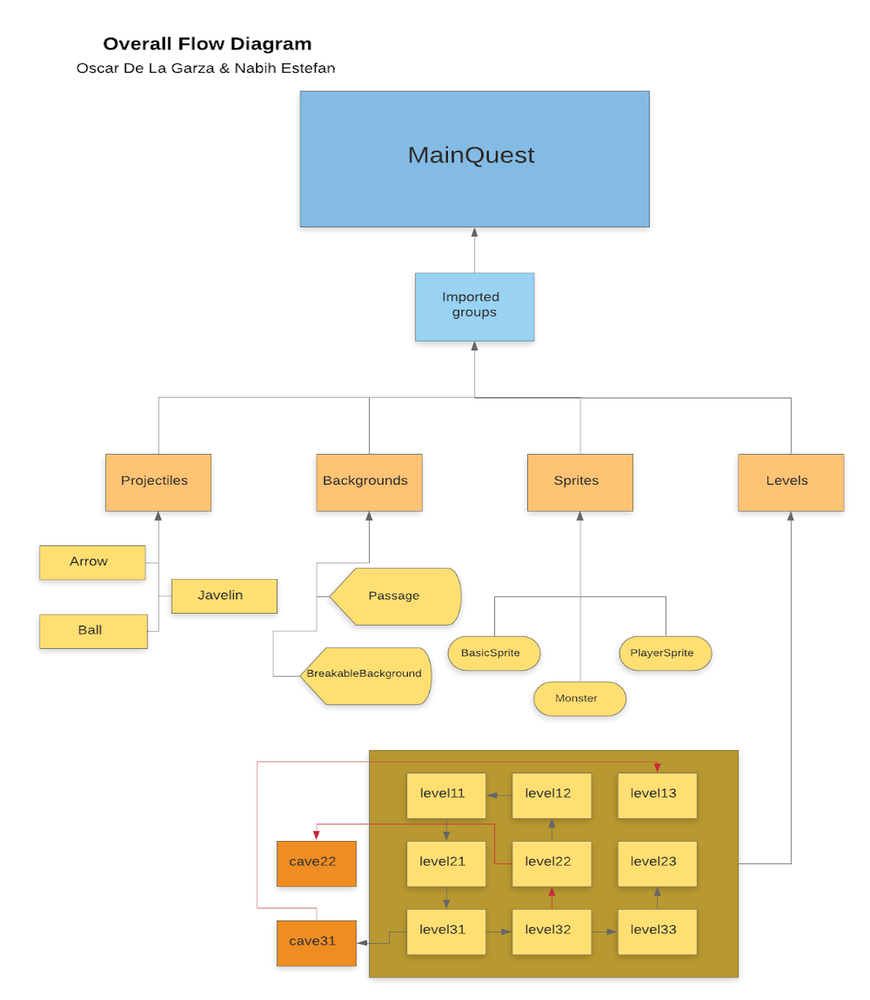

# Medieval Quest

This is a rundown of the Overall Flow Diagram of our game and how to intepret it.

## Overall Flow Diagram

Here in the Overall Flow Diagram we can see all the imported groups that filter into our game.py file. This is the file that contains our main game class "MainQuest". As for the structure of this diagram, the 4 main imported groups seen are "Projectiles", "Backgrounds", "Sprites", and "Levels".

The first we shall look at is "Projectiles". Inside of this group there exists 3 classes: "Arrow", "Javelin", and "Ball".
The "Arrow" class is made for the player, the King, for the use of his bow and shooting the accompianing arrows. The 
"Javelin" is a projectile weapon carried by the Troll, one of the enemies in the game, and intended to attack the player. Lastly the "Ball" is also a projectile weapon shot by the Shooter, one of the enemies in the game, and intended to attack the player as well.

Secondly we shall talk about "Backgrounds". Here we have two classes defined, "Passage" and "BreakableBackground". "Passage" creates the specific backgrounds that will trigger a change in level-frame and allow the player to progress. "BreakableBackground" creates a specific background that is able to be broken by a bomb, one of the items the player can find, and destroy the wall present to create a "Passage" and continue through the game.

Next we have "Sprites". Here we have three imported files: "BasicSprite", "PlayerSprite", and "Monster". "BasicSprite" contains the classes for a basic player sprite and enemy, as well as usable items, like potions, and numbers for the inventory. "PlayerSprite" contains the King's sprite and his corresponding images for attacking or direction. Lastly "Monster" contains the enemy sprites and their images and attacks.

Finally we have "Levels". Here we have the 9 overworld levels and 2 cave levels defined by an array indexing. Each contains a class similar in defining need images and defining the graphical layout of its background by an array of values that correspond each to a particular image.
