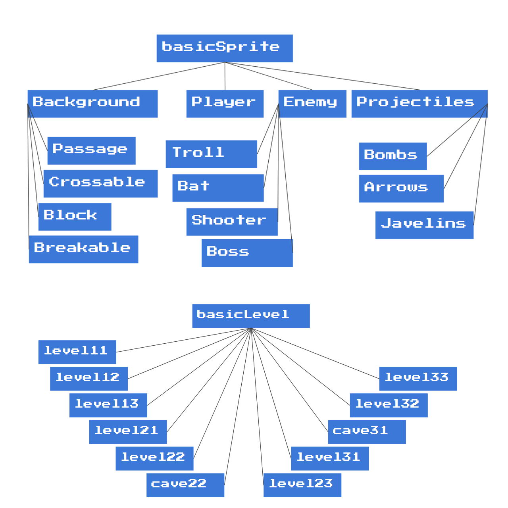
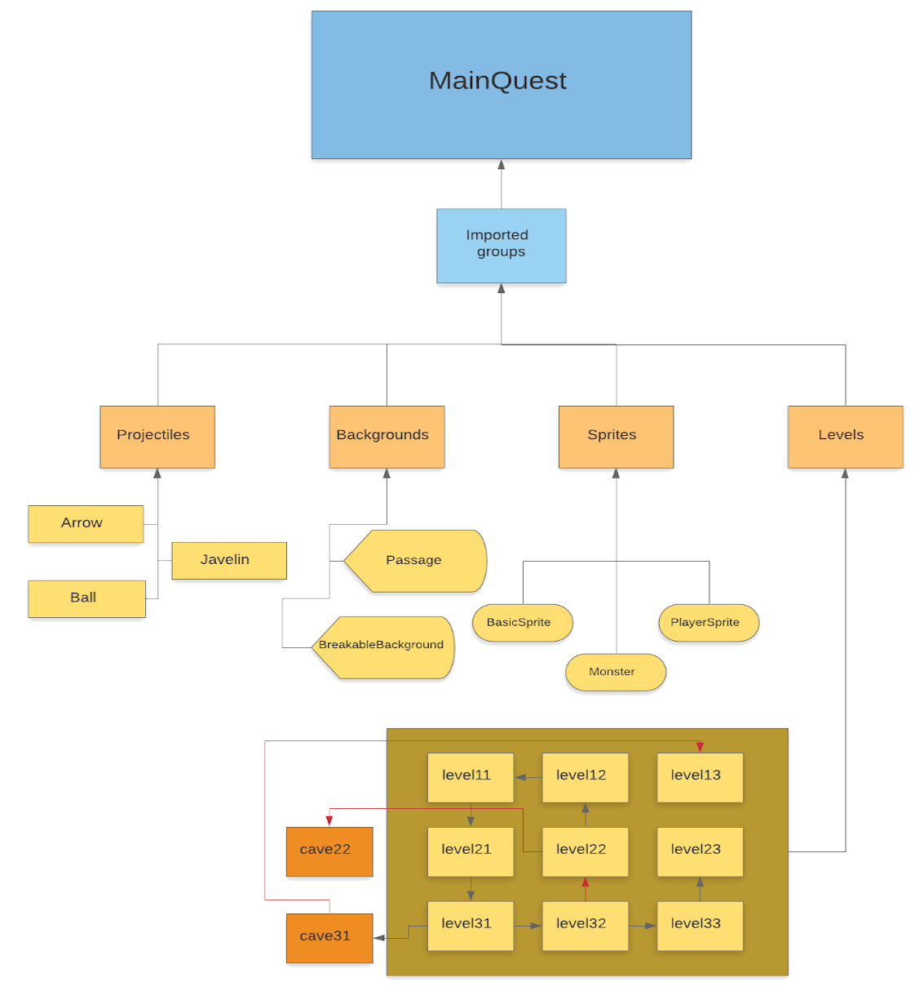
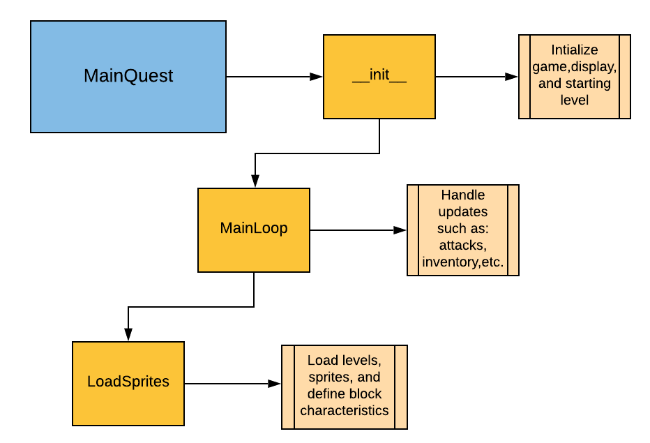
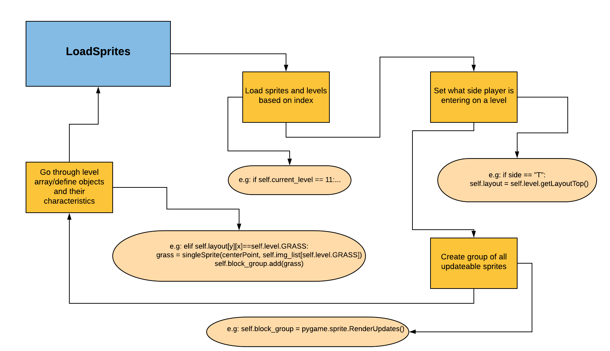
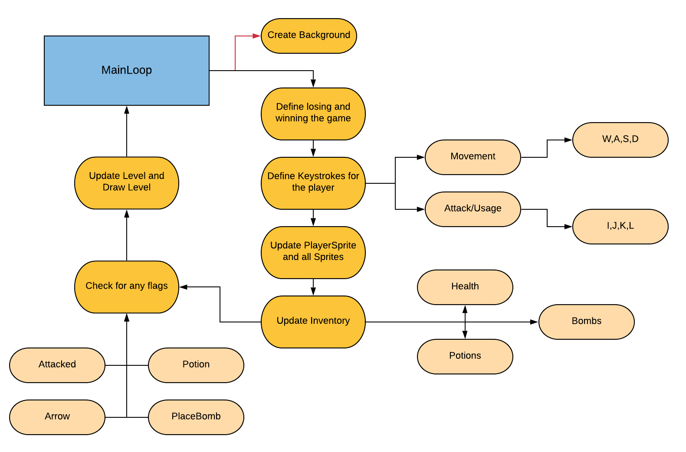
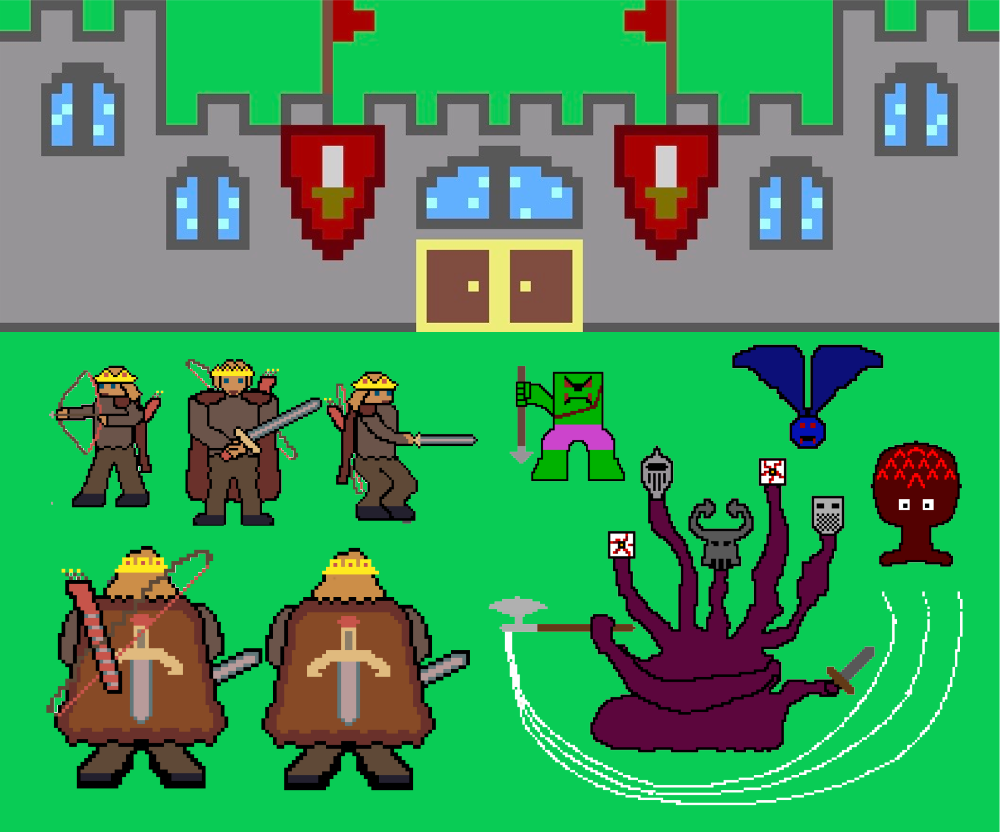
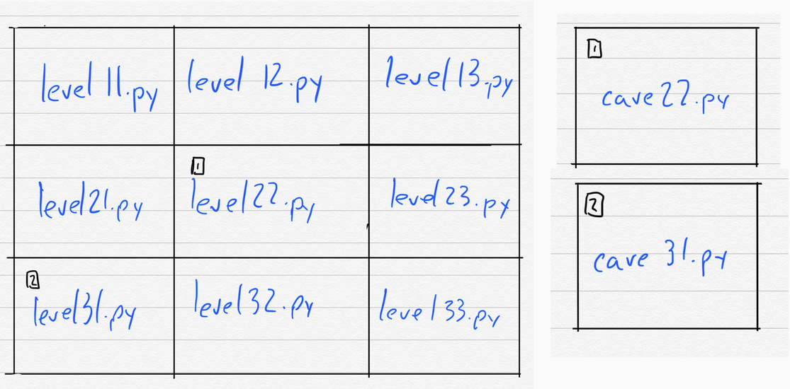
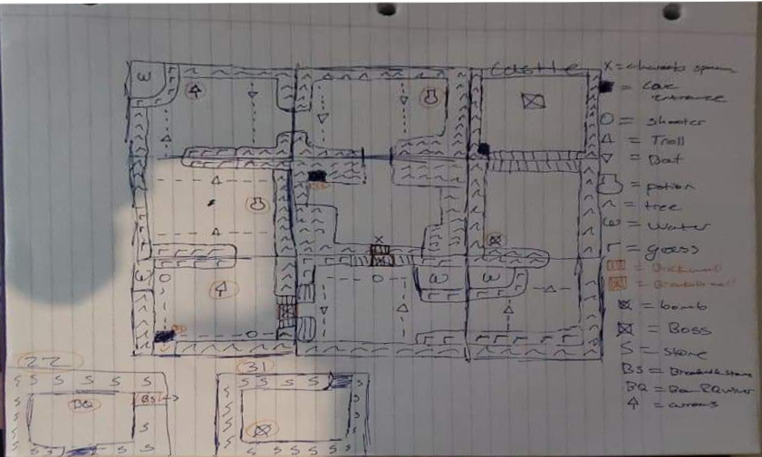

# The Game

[Home](https://sd2020spring.github.io/Medieval-Quest/)


[GamePlay](https://sd2020spring.github.io/Medieval-Quest/GamePlay/)

## Goal of this project

Our goal for this project was to create an interactive fun game for people to play so that they would be ale to invest their time in quarentine towards an entretaining idea.

## Game Information

### Usage

The usage of this game is really simple. Once the Installation procedure has been done, just go to the folder where `game.py` is in your computer and run
```
python game.py
```
in the terminal. Once you have done this, a screen will pop up showing you the first frame of the game. Now in game, you only need to use WASD to move (W is forwards, A if Left, S is Backwards, and D is Right) and the use J to attack with your sword, K to shoot your arrows (once acquired), L to place bombs (if you have them), and I to use Health Potions (If you have them)

<br>

## Results 
 <video>
  <source src="images/gameplay.mp4" type="video/mp4">
</video> 

## Software Impact Statement 
In our specific case, the ethical considerations of our project weren't so impactful. Since we just wanted to create a fun game for people to play with, our stakeholder were the players. The only impact on them would be having an amazing time when playing, and deciding they want more. There are no big unintended consequences qwee could think of when developing this software in real world scenarios. The only unitended consequence we could think of would be creating an amazing franchise of games that redefines gaming for all ages (just like The Legend of Zelda, the game which gave us our idea, did).

## Project evolution/narrative 

Medieval Quest was a game that evolved in a very simple and straightforward manner. When we started, we started working on three different fronts:
### Architecture
For the architecture of the game, we were able to very easily settle on what we currently use. We started by listing the classes we would need and separate them in different inheritance levels. 

This slowly evolved into our current achitecture.The easiest way to explain it is throught a series of nested flow diagrams. The biggest one the shows the <b>overall architecture and run of the code</b> is this one.<br>

As you can see, the most important part of this one is the <b>MainQuest</b>, which can be seen in more detail in teh following diagram.<br>

As you can see,<b>MainQuest</b> has to very important parts, which can both be seen in more detail below. On the left, you can see how <b>LoadSprites</b> runs, and on the right, you can see how <b>MainLoop</b> works.



### Visual Design
In our case, we both had very similar ideas to what our game should look like, so we just started working on images which eventually developed into bakcgrounds, enemies, and the player.


### Game Layout
The game layout was fairly easy to do. When we started we settled on the idea of a 3x3 grid of frames, since this was a big enough number for the world to feel semi-developed, but small enough for it to be achievable between the two of us. We also decided we should have caves, and both of us agreed that two caves seemed to be the right number of caves for our 3x3 world. Initially our overall design was the following:

Which afterwards evolved into this design (Which is the hand-drawn sketch of the design we actually use for our levels):


## Attributions
The only external sources used were:
- <a href="https://en.wikipedia.org/wiki/The_Legend_of_Zelda">The Legend of Zelda</a> as a starting idea point <br>
- PyMan tutorial as a architecture tutorial and to see how to develop the game itself
