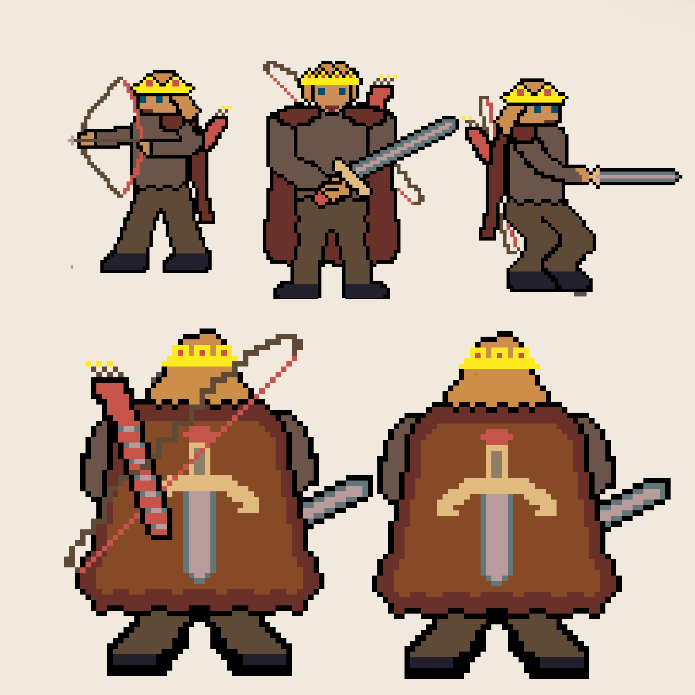
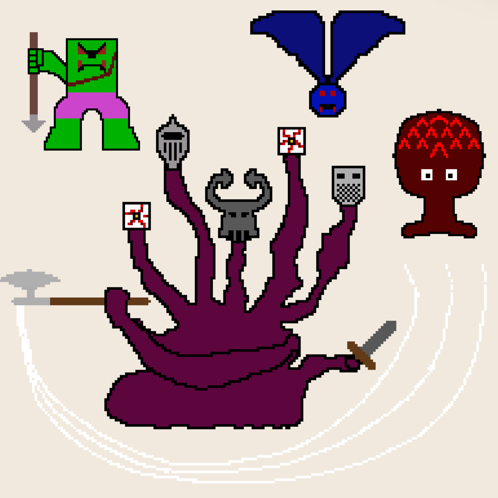

# The Game

## Goal of this project

## Game Information

### Plot

In a far away place, in another time, a King was the protector of his kingdom. Everyone loved him, because he was the most benevolent King they had had. He cared for every single person in his kingdom and since his first day, vowed to put every life in his kingdom bfore his own. The people, although they loved him, thought this was just hyperbole, the king would not put his life last, he was human, and humans were selfish. 

Time passed, and everyone forgot about this promise, the kingdom was at the longest period of peace they had enjoyed, and there was no way to destroy that. Or so they thought. One day, at the crack of dawn, the people woke up to see their king walking the streets, with his trusty sword and bow, a bad of bombs and many more items. He was walking with purpose, like never before, and the people were scared. What was happening? Why was their king armed to the teeth?

The answer came as a roar out of the forest. The monsters had allied before The Boss, a mythical five headed monster that had been rumored ot kill countless soldiers. This was the moment where the people remember their Kings promise, the one they had cast out as an exageration. The moment the King stepped out of the fortress walls, order his men to close them, and told them to keep them that way until he was back the people realized, they king was ready to sacrifice his live to save theirs, and they hope he wouldn't have to, but they couldn't do anything now.

### Gameplay



<p aling="left">
This is how the story transpired up until the moment the player comes in. The moment the game start, the palyer is in the middle of the woods, having lost everything but his trusty sword, and he has to battle his way back to the castle, which has, right outside the gates, a waiting Boss who wants to take controll of the kingdom.<br>

At the start of the game, the player can only move and attack with his sword, and eventually, he is able to get Bombs, Potions and a Bow&Arrow. The Bombs and Potions have a counter at the bottom, a counter that shows how many of these the player has left. The Arrows for the Bow are unlimited.

The layout of the game is a 3x3 screen of frames (of which the player only sees one at a time) and two separate frames that are caves, which the player can access at different points in the game. What the player does to access these is walk up to the different parts of the border of the screen that lead to other frames, and when he collides with these, the player will be transported to the new screen.
</p>


There are 4 enemies throughout the game: 

- Trolls, who throw javelins once they see the player <br>
  
- Bats, who follow the player and try to bite him <br>
  
- Shooters, who shoot balls at the player <br>
  
- The Boss, who has 3 different types of attack<br>
  * Front attack: Both swords forward <br>
  * Side attack: One sword to each side <br>
  * Sweep attack: Swing in front and sides with ax <br>

<br><br><br>
### Installation

There are only two things required when installing Medieval Quest. 
1. Make sure to have PyGame installed.
  To install pygame in Linux run the following commands:
 ```
  $ apt-get build-dep python-pygame
  $ apt-get install mercurial python-dev python-numpy ffmpeg libsdl-image1.2-dev libsdl-mixer1.2-dev libsdl-ttf2.0-dev libsmpeg-dev libsdl1.2-dev libportmidi-dev libswscale-dev libavformat-dev libavcodec-dev
  $ pip install pygame
 ```
2. Go to the main game file (`game.py`) and in the second line, change the path takes to the Levels folder to your own path on your computer.

### Usage

The usage of this game is really simple. Once the Installation procedure has been done, just go to the folder where `game.py` is in your computer and run
```
python game.py
```
in the terminal. Once you have done this, a screen will pop up showing you the first frame of the game. Now in game, you only need to use WASD to move (W is forwards, A if Left, S is Backwards, and D is Right) and the use J to attack with your sword, K to shoot your arrows (once acquired), L to place bombs (if you have them), and I to use Health Potions (If you have them)

## Implementation Information
Code doesn’t tell a story by itself. Use more effective methods such as flowcharts and architectural, class, or sequence diagrams to explain how your code works. You could consider including or linking to snippets of code to highlight a particularly crucial segment.
  
 ## Results 
 <video width="320" height="240" controls>
  <source src="movie.mp4" type="images/gameplay.mp4">
</video> 

## Software Impact Statement 
Reflect on the ethical considerations you made throughout the design process, starting with project ideation and the priorities you set for your team. You should think of all of the stakeholders that might be impacted by your project and unintended consequences of the deployment of your software in real world scenarios. Discuss strategies for mitigating these issues.

## Project evolution/narrative 
Tell an illustrative story about the process of creating your software, showing how it improved over time. This may draw upon what you learned from the two peer technical reviews and from the code review. Consider the use of screenshots or other tools to demonstrate how your project evolved.


## Attributions
The only external sources used were:
- The Legend of Zelda as a starting idea point <br>
- PyMan tutorial as a architecture tutorial and to see how to develop the game itself
